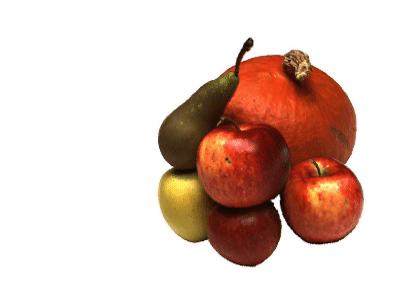

# NeuMesh Manipulation
Here we provide some [manipulation cases](https://zjueducn-my.sharepoint.com/:f:/g/personal/12021089_zju_edu_cn/EmEjhcYEOGZJj_EOOMYPFxQBkzBGzwYFyYPaWeob0PTSng?e=DNXtJx) used in our experiments. The cases are saved inside `checkpoints/[sequence_name]/editing` directory.
## Geometry Editing
Here we show how to perform geometry editing on one example scene.
1. Deform the prior mesh with off-the-shelf 3D modelling software (Blender, MeshLab, etc).
2. Create the editing config(`.json`):
    * `main_config`: the path of neumesh config.
    * `deformed_mesh`: the path of deformed prior mesh.
3. Synthesize novel views of the edited scene.
```python
python -m editing.render_geometry_editing --config configs/geometry_editing/dtuscan83_wave.json --load_pt checkpoints/dtu_scan83/neumesh/latest.pt  --outdirectory geometry_editing --downscale 4 --background 1
```
<div align=center>

</div>

## Texutre Swapping
You can replace the selected texture of main neumesh with desirable texture of reference neumesh.
Here we show how to perform texture swapping on one example scene. 
1. Mask out the swapped region of main prior mesh and reference mesh with the off-the-shelf 3D modelling software (Blender, MeshLab, etc). The swapped regions are detected by the **color** of vertices. **The color of swapped vertices are white(255,255,255) and others are black**.
    * Our code requires that the vertex order of mask mesh equals to that of prior mesh.
    * In Blender, you can paint the color of vertices under `vertex paint` mode and export the mask mesh as `.ply` format with only vertex coordinates and vertex colors.
<!-- You can perform texture swapping with provided configs to swap the texture of red and gold apples on dtu_scan 63. -->
2. Create the editing config(`.json`):
    * `main_config`: the path of main neumesh config.
    * `main_mask_mesh`: the path list of masked main mesh. 
    * `main_ckpt`: the path of main neumesh checkpoint.
    * `ref_config`: the path list of reference neumesh config.
    * `ref_mask_mesh`: the path list of masked reference mesh.
    * `ref_ckpt`: the path list of reference neumesh checkponts.
3. Manually align main mesh and reference mesh. The alignment information will be written automatically in the editing config:
    * `T_r_m`: similarity transformation from main neumesh to reference neumesh.
    * `corr`: the vertex correspondences between the main mesh and the reference mesh.
```python
python -m editing.render_texture_swapping --config configs/texture_swapping/dtuscan63_apples.json --debug_draw --estimate_srt 0
```
`--estimate_srt 0` enables manual alignment of the first swapped regions between the main mesh and the reference mesh.

4. Synthesize novel views of the edited scene.

```python
python -m editing.render_texture_swapping --config configs/texture_swapping/dtuscan63_apples.json --downscale 4 --outdirectory texture_swapping --test_frame 24 --spiral_rad 1.2  --background 1
```

<div align=center>

</div>

## Texture filling
You can fill the selected texture of main neumesh with desirable texture of reference neumesh.
Here we show how to perform texture filling on one example scene.
1. Mask out the filled region of main prior mesh and template texture of reference mesh with the off-the-shelf 3D modeling software (Blender, MeshLab, etc). The selected region are detected by the **uv coordinate** of vertices. **The uv coordinate of selected vertices are not empty and others are empty(0,0)**.
    * In Blender, you can unwarp the uv coordinate of selected vertices in the `UV Editing` window and export mask mesh as `.obj` format with only vertex coordinate and uv coordinate.
2. Create the editing config(.json):
    * `main_config`: the path of main neumesh config (`teacher_config`, `teacher_ckpt` should be specified in the config).
    * `main_mask_mesh`: the path list of masked main mesh. 
    * `main_ckpt`: the path of main neumesh checkpoint.
    * `ref_config`: the path list of reference neumesh config.
    * `ref_mask_mesh`: the path list of masked reference mesh.
    * `ref_ckpt`: the path list of reference neumesh checkponts.
    * `step`: the relative scale of reference uv map compared to main uv map. In default, we assume that the size of main and reference uv map is 1.0x1.0. If `step=2`, the size of reference uv map is 0.5x0.5 (=1.0/2).
3. Synthesize novel views of the edited scene.
```python
python -m editing.render_texture_filling --config configs/texture_filling/dtuscan118_whiteangle.json --downscale 4 --outdirectory texture_filling --spiral_rad 1.2 --test_frame 61 --background 1
```
<div align=center>

</div>


## Texture painting
Here we show how to perform texture painting on one example scene.
You can download [the painting dataset of the example](https://zjueducn-my.sharepoint.com/:u:/g/personal/12021089_zju_edu_cn/ESrrMz-wpcRIm2TJvAJyGjABS4PZuTkeldjKsxAlO18yRw?e=fIijMG) or prepare by yourself.

1. Prepare the painting dataset as follows:
    * `image`: painted image.
    * `mask`: silhouette of the painted image.
    * `paint_mask`: painted region (a slight dilation is preferred).
    * `cameras_sphere.npz`: camera parameters of the painted view.
2. Create the painting config(`.json`):
    * `main_config`: the path of neumesh config.
    * `ckpt_path`: the path of neumesh checkpoint.
    * `paint_name`: the affix name of the experiment name.
    * `paint_dir`: the path of the painting dataset.
    * `num_iters`: the number of training iteration.
3. Fine-tune the neumesh with the painting dataset.
```python
python -m editing.paint --config configs/paint/dtuscan105_whiteglass.json
```
4. Synthesize novel views of the edited scene.
```python
python -m render --config checkpoints/dtu_scan105/neumesh/config.yaml --load_pt logs/neumesh_dtuscan105_paint/ckpts/latest.pt --downscale 4 --outdirectory paint --test_frame 33 --spiral_rad 1.2 --background 1
```
<div align=center>

</div>

